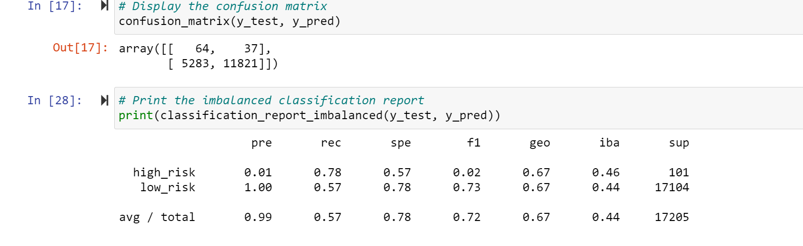

# Credit_Risk_Analysis

## Overview of the analysis
Since there is always a risk in giving loans, we are going to analyze how lenders can predict whether a client is approvable for getting loan or not. Six Machine Learning models are being used to predict the credit risk in this project and results will be displayed later on:

1- Oversampling

2- Undersampling

3- Combination of Oversampling and Undersampling

4- Balanced Random Forest Classifier

5- Easy Ensemble AdaBoost Classifier

## Results
The result of each model :

**_Oversampling_** Model:

The accuracy score of the model is: 0.6503524738582371

**_SMOTE Oversampling_** Model:

The accuracy score of the model is: 0.662394124702461

**_Undersampling_** Model:

The accuracy score of the model is: 0.5447339051023905

**_Combination (Over and Under) Sampling_** Model:

The accuracy score of the model is: 0.6774256383776824

**_Balanced Random Forest Classifier_** Model:

The accuracy score of the model is: 0.7885466545953005

**_Easy Ensemble AdaBoost Classifier_** Model:

The accuracy score of the model is: 0.9316600714093861

## Summary

In all other models such as Undersampling, Oversampling and Combination the accuracy score is low. The highest accuracy score is for Easy Ensemble AdaBoost Classifier which is 0.93 and it it shows we can use this model for prediction, also, precision and recall for being low risk is really high wich recommends to use this model.
